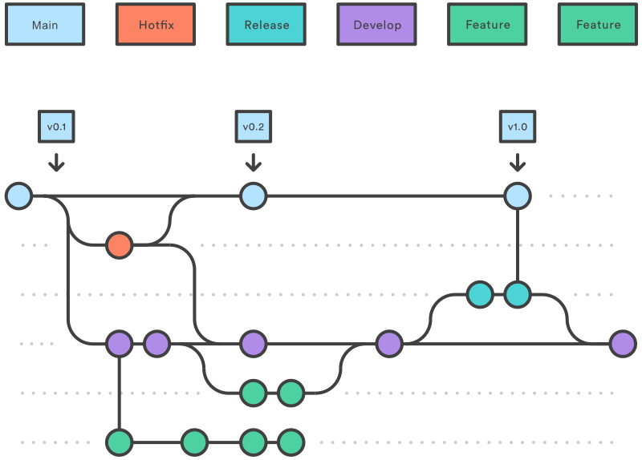

<<<<<<<< HEAD:administration/02-devops/git/scv3.md
# Как работать над проектом

[Следующая статья](scv4.md)

---
## Команды из статьи
+ ```git branch -a```
+ ```git branch <new_branch>```
+ ```git checkout <new_branch>```
+ ```git checkout -b```
+ ```git log --oneline --decorate```
+ ```git branch -D <deleted_branch>```
---

Всякое пердприятие можно запороть, если выбрать неправильный технический процесс. Разработка ПО - дело крайне сложное и запутанное. Оно только усложняется и запутывается с увеличением количества разработчиков и с разрастанием самого проекта. Поэтому нужно очень хорошо знать организацию труда.

При изучении системы контроля версий данное обстоятельство крайне важно так как она является способом смоделировать тех процесс. Для этого у неё есть специальный инструмент - ветки (**branch**). Так как система распределённая в полном смысле этого слова, то и в наших руках оказывается достаточно гибкий инструмент. Его мы можем применять по своему усмотрению. Но как и в любом деле, многолетняя практика позволяет перенять передовой опыт более успешных товарищей. Более того, сложилось несолько традиций. Здесь мы обозначим подход двух из них: Gitflow и магистральной разработки. Однако начнём с теории.
## Ветвление

Что такое ветка? В физическом мире мы так называем отростки от стволов и других веток у деревьев. То есть ключевым является наличие того ОТ ЧЕГО будет что-то отрастать. В компьютерных науках подобная абстракция встречается нередко, например на ней основано немало алгоритмов, концепций структур данных и много чего ещё. Причина проста: информация нередко обладает свойством наследственности. Как и в нашем случае. Мы имеем коммит, который мы сделали на основании предыдущего коммита, у которого тоже был предшественник. И так до коммита инициализации - первый коммит не имеет родителя.

Технически это обозначает, что нам нужно создать в описании коммита поле "родитель" (**parent**), тогда мы можем в случае необходимости у двух и более разных коммитов указывать одного родителя. Что, собственно и будет техническим воплощением ветвления.
### Операции

Прежде, чем создавать новую ветку, нужно сделать снимок текущего состояния. Затем командой ```git branch -a``` проверяем какие ветки у нас уже созданы. Следующий шаг - это создание ветки

```bash
$ git branch draft

$ git branch -a
  draft
* master
  remotes/origin/HEAD -> origin/master
  remotes/origin/master

$ git checkout draft
Switched to branch 'draft'
```

Чтобы не вводить две команды (```git branch``` и ```git checkout```) используют ключ ```-b``` у команды ```git branch```:

```bash
$ git branch -b draft
```

Есть нюанс: если мы закоммитим какие-то изменения, то при попытке запушить их из данной ветки выскочит ошибка:

```bash
fatal: The current branch draft has no upstream branch.
To push the current branch and set the remote as upstream, use

    git push --set-upstream origin draft

To have this happen automatically for branches without a tracking
upstream, see 'push.autoSetupRemote' in 'git help config'.
```
Как из неё выйти тут же и написано. А заключается она в том, что команда ```push``` должна запускаться с опцией ```--set-upstream``` то есть с установленным потоком - знать она должна каким соединением пользоваться. Так и делаем. После этого на GitHub видим следующую картину:


С pull request разберёмся позже, сейчас определимся с защитой ветки. Если наш аккаунт на GitHub - это коллективный аккаунт, то это возможность защитить основную ветку от "шаловливых" ручек или от случайных действий, которые могут повлечь потери времени и сил на исправление ошибок. Пока откажемся (Dismiss). В любой момент можно добавить правила защиты через *Settings* (В проекте) → *Code and automation* → *Branches* → *Branch protection rules*

### Ещё раз про HEAD и указатели.

Как говорилось ранее, HEAD - это указатель на коммит. Иначе его называют курсором GIT. Он определяет, в каком состоянии находится рабочая копия. На какой коммит указывает HEAD – из того коммита и загружаются файлы в рабочую директорию. 

> Однако GIT позволяет создавать и другие ссылки. Если мы вручную передвигаем HEAD на один из непоследних коммитов, то у нас появляется указатель ORIG_HEAD, которой будет указывать на тот же коммит, на который указывал HEAD до передвижения назад. Нужен он, чтобы мы имели возможность вернуться на хронологически последний коммит без существенных затрат (в истории мы не будем видеть все коммиты старше нашего, а поэтому не сможем узнать хэш последнего).
>
> Также мы можем создавать пользовательские указатели. Например, можно создать указатель, с именем соответствующим номеру версии и в случае необходимости переходить по названию коммита, а не по хэшу.
>
> Делается это как-то спомощью команды ```git symbolic-ref <HEAD> <ref_name> ```. Но я создал отдельную ветку, которая к основной вообще никакого отношения не имеет. Разберусь с этим позже.

Однако указатели интересуют нас в рамках изучения ветвления по той причине, что именно они позволяют легко и непринуждённо создавать новые ветки. Как мы говорили, что ветка образуется тогда, когда у двух коммитов в качестве родителя объявляется один коммит. 

Немного вернёмся назад и поясним что такое коммит с программной точки зрения. На самом деле коммит - это объект. И полями этого объекта мы принимаем метаинформацию (кто, когда сделал коммит), куазатель на снимок подготовленных (```git add```) данных и родителя(-ей). Если углубиться совсем, то при индексации (```git add```) вычисляется хэш-сумма каждого файла, затем каждый файл сохраняется в репозиторий в виде ***блоба*** (см. *Педивикию*), которые также являются объектами. Хэш-сумма попадает в индекс и при фиксации (```git commit```) GIT вычисляет хэш-суммы каждого подкаталога и сохраняет его как объект дерева каталогов. В конце фиксации у нас получается три вида объектов: сам коммит, блобы (на каждый файл из индекса подготовленных) и объект дерева каталогов (чтобы можно было расположить файлы по папкам).

Мы не можем работать с репозиторием вне какой-либо ветки. По той простой причине, что с технической точки зрения ветка - это простой перемещаемый указатель на один из наших коммитов. Причём подразумевается не *HEAD* (курсор GIT), а, например в случае ветки по-умолчанию, *master*. Когда мы создаём новую ветку (```git branch```), то мы создаём новый указатель. Для коммита, который мы уже сделали и потом ввели команду ```git branch``` получается создаётся второй указатель (*master* и *new_branch*). 

А где тут HEAD? А давайте определим это, ребята!

```bash
$ git log --oneline --decorate
73559ed (HEAD -> master, new_branch) Your comment
```
То есть HEAD указывает на master, значит мы сейчас на ветке *master*, хотя *new_branch* находится в списке указателей. Ну и как уже выше говорилось, перемещение между ветками происходит командой ```git checkout```

```bash
$ git checkout new_branch

$ git log --oneline --decorate
73559ed (HEAD -> new_branch, master) Your comment
```

Как видим, коммит тот же (73559ed), но HEAD указывает на *new_branch*.


### Слияние, конфликты и их разрешение
Для слияния веток используют команду  ```git merge <branch>```. Это делают из более "старшей" ветки. Поэтому делают последние добавления, коммиты и чекаутятся в, например, master, где и происходит всё действо.

Если у нас были какие-то pull request между этими ветками, то всё исчезает и мы видим единую историю в master, в которой будут видны все наши действия по работе во "младшей" ветке.

Однако представим себе ситуацию, при которой кто-то внёс коммит в ветку, в которой мы  закоммитили тот же файл, в котором поменял ТУ ЖЕ строку (или строки). Этот кто-то залил на GitHub эти изменения и теперь, когды мы пытаемся запушиться, получаем следующее:

```bash 

$ git push
To github.com:boyko1989/ITCO.git
 ! [rejected]        draft -> draft (fetch first)
error: failed to push some refs to 'github.com:boyko1989/ITCO.git'
hint: Updates were rejected because the remote contains work that you do
hint: not have locally. This is usually caused by another repository pushing
hint: to the same ref. You may want to first integrate the remote changes
hint: (e.g., 'git pull ...') before pushing again.
hint: See the 'Note about fast-forwards' in 'git push --help' for details.

# Говорит, что на удалённом репозитории есть контент, которого нет в локальном репозитории, поэтому нужно сделать git pull - делаем

$ git pull
remote: Enumerating objects: 11, done.
remote: Counting objects: 100% (11/11), done.
remote: Compressing objects: 100% (5/5), done.
remote: Total 6 (delta 3), reused 0 (delta 0), pack-reused 0
Unpacking objects: 100% (6/6), 868 bytes | 11.00 KiB/s, done.
From github.com:boyko1989/ITCO
   2c1ed60..f34dacb  draft      -> origin/draft
Auto-merging administration/devops/git/scv3.md
CONFLICT (content): Merge conflict in administration/devops/git/scv3.md
Automatic merge failed; fix conflicts and then commit the result.

```
Ну и слово "CONFLICT" намекает на то, что у нас обнаружился конфликт. Текстовый редактор в этом месте нам покажет следующую картину:

```md


```

До строчки, заполненной знаками "равно" мы имеем локальное содержимое, а после - содержимое на удалённом сервере. Решается всё просто: удаляем то, что нам не нравится (возможно это будет всё) и прописываем то, что хотим видеть на этом месте в проекте. После этого ```git add ... ``` ```git commit ... ``` и пушимся. Собственно конфликт будет исчерпан.
## Методики работы над проектом

### Gitflow
Данный тип организации работ в настоящее время используется намного меньше и считается устаревшим вследствие всё большего распространения процессов CI/CD, для которых лучше подходит метод магистральной разработки.

####  Назначение веток внутри проекта
Суть метода состоит в том, что мы изначально разделяем проект на три больших типа веток:
+ **master** - основная ветка проекта которая содердить последнюю стабильную версию проекта;
+ **develop** - ветка разработки, которая представляет собой рабочую версию проекта. Это рабочая версия и всмысле процесса и всмысле состояния: вполне можно практически пользоваться результатом работы из ветки *develop*, хотя это не официальный релиз и последний коммит в *master* гораздо болеее надёжен.
+ **features** - функциональные ветки. Для каждой отдельной функции продукта создаётся отдельная ветка, которая сливается с *develop* в процессе дозревания. Ни в коем случае не сливать эти ветки в *master* !!! Суть метода как раз и состоит в том, что происходит постепенное дозревание проекта: версии постепенно перетекают с одного логического уровня на другой.
+ **release** - ветка релиза. После наполнения ветки *develop*, происходит подготовка к релизу в отдельной ветке. В неё сливается ветка *develop* и *master*. Проводятся тесты и после релиза ветка удаляется. Основой данной ветки является *develop*.
+ **hotfix** - ветка исправления (сопровождения). Если в выпущенном релизе обнаружился баг, то заводится эта временная ветка, в которой ведётся работа по его устранению. Так же как и ветка *release*, она создаётся слиянием *develop* и *master*, но создаётся на основе *master*. После мерджа в *master*, ветка удаляется.



Существует отдельная утилита **git flow**, которая автоматизирует создание этих веток. Дело в том, что нужно очень чётко работать с этой моделью, чтобы получить все её преимущества. И если по всем правилам, например завершать работу над исправлением, то в нативном приложении git нужно выполнить следующий набор действий:

```bash
git checkout master
git merge hotfix_branch
git checkout develop
git merge hotfix_branch
git branch -D hotfix_branch
```
При использовании git flow

```bash
$ git flow hotfix finish hotfix_branch
```
Разница, как очевидно, на лице.

#### Последовательность действий при работе по модели Gitflow:

+ Из ветки **master** создается ветка **develop**.
+ Из ветки **develop** создается ветка **release**.
+ Из ветки **develop** создаются ветки **feature**.
+ Когда работа над веткой **feature** завершается, она сливается в ветку **develop**.
+ Когда работа над веткой **release** завершается, она сливается с ветками **develop** и **master**.
+ Если в ветке **master** обнаруживается проблема, из **master** создается ветка **hotfix**.
+ Когда работа над веткой hotfix завершается, она сливается с ветками **develop** и **master**.

<br>

### Магистральная разработка

При этом методе контроля версий разработчики объединяют небольшие частые обновления с центральной "магистралью" - основной веткой. При этом ветки "живут" очень недолго - фактически столько, сколько разработчик работает над задачей (**task**), ради которой её завёл (а не ради функции, как в Gitflow). Поэтому, чтобы в *master* не попадал всякий мусор, применяются методы автоматического тестирования, мониторинга и оповещения. Так как слияние происходит постоянно, то и развёртывание приложения также автоматизируют. Можно сказать, что эту методику разработали для CI/CD и под вдохновением от CI/CD.

---
## Источники:
+ [Smartiqa - Ветвление. Создание, переключение и удаление веток.](https://smartiqa.ru/courses/git/lesson-3)
+ [Atlassian - Рабочий процесс Gitflow Workflow](https://www.atlassian.com/ru/git/tutorials/comparing-workflows/gitflow-workflow)
+ [GIT официальная документация - 3.1 Ветвление в Git](https://git-scm.com/book/ru/v2/%D0%92%D0%B5%D1%82%D0%B2%D0%BB%D0%B5%D0%BD%D0%B8%D0%B5-%D0%B2-Git-%D0%9E-%D0%B2%D0%B5%D1%82%D0%B2%D0%BB%D0%B5%D0%BD%D0%B8%D0%B8-%D0%B2-%D0%B4%D0%B2%D1%83%D1%85-%D1%81%D0%BB%D0%BE%D0%B2%D0%B0%D1%85)

---
=======
# Как работать над проектом

[Следующая статья](scv4.md)

---
## Команды из статьи
+ ```git branch -a```
+ ```git branch <new_branch>```
+ ```git checkout <new_branch>```
+ ```git branch -b```
+ ```git log --oneline --decorate```
+ ```git branch -D <deleted_branch>```
---

Всякое пердприятие можно запороть, если выбрать неправильный технический процесс. Разработка ПО - дело крайне сложное и запутанное. Оно только усложняется и запутывается с увеличением количества разработчиков и с разрастанием самого проекта. Поэтому нужно очень хорошо знать организацию труда.

При изучении системы контроля версий данное обстоятельство крайне важно так как оно является способом смоделировать тех процесс. Для этого у неё есть специальный инструмент - ветки (**branch**). Так как система распределённая в полном смысле этого слова, то и в наших руках оказывается достаточно гибкий инструмент. Его мы можем применять по своему усмотрению. Но как и в любом деле, многолетняя практика позволяет перенять передовой опыт более успешных товарищей. Более того, сложилось несолько традиций. Здесь мы обозначим подход двух из них: Gitflow и магистральной разработки. Однако начнём с теории.
## Ветвление

Что такое ветка? В физическом мире так мы называем отростки от стволов и других веток у деревьев. То есть ключевым является наличие того ОТ ЧЕГО будет что-то отрастать. В компьютерных науках подобная абстракция встречается нередко, например на ней основано немало алгоритмов, концепций структур данных и много чего ещё. Причина проста: информация нередко обладает свойством наследственности. Так и в нашем случае. Мы имеем коммит, который сделали на основании предыдущего коммита, и у которого тоже был предшественник. И так до коммита инициализации - первый коммит не имеет родителя.

Технически это обозначает, что нам нужно иметь в описании коммита поле "родитель" (**parent**), тогда мы можем в случае необходимости у двух и более коммитов указывать одного родителя. Что, собственно и будет техническим воплощением ветвления.
### Операции

Прежде, чем создавать новую ветку, нужно сделать снимок текущего состояния. Затем командой ```git branch -a``` проверяем какие ветки у нас уже созданы. Следующий шаг - это создание ветки

```bash
$ git branch draft

$ git branch -a
  draft
* master
  remotes/origin/HEAD -> origin/master
  remotes/origin/master

$ git checkout draft
Switched to branch 'draft'
```

Чтобы не вводить две команды (```git branch``` и ```git checkout```) используют ключ ```-b``` у команды ```git checkout```:

```bash
$ git checkout -b draft
```

Есть нюанс: если мы закоммитим какие-то изменения, то при попытке запушить их из данной ветки выскочит ошибка:

```bash
fatal: The current branch draft has no upstream branch.
To push the current branch and set the remote as upstream, use

    git push --set-upstream origin draft

To have this happen automatically for branches without a tracking
upstream, see 'push.autoSetupRemote' in 'git help config'.
```
Как из неё выйти тут же и написано. А заключается ошибка в том, что команда ```push``` должна запускаться с опцией ```--set-upstream```, то есть с установленным потоком - она должна знать каким пользоваться соединением. Так и делаем. После этого на GitHub видим следующую картину:


С pull request разберёмся позже, сейчас определимся с защитой ветки. Если наш аккаунт на GitHub - это коллективный аккаунт, то это возможность защитить основную ветку от "шаловливых" ручек или от случайных действий, которые могут повлечь потери времени и сил на исправление ошибок. Пока откажемся (Dismiss). В любой момент можно добавить правила защиты через *Settings* (В проекте) → *Code and automation* → *Branches* → *Branch protection rules*

### Ещё раз про HEAD и указатели.

Как говорилось ранее, HEAD - это указатель на коммит. Иначе его называют курсором GIT. Он определяет, в каком состоянии находится рабочая копия. Из коммита, на который указывает HEAD и  загружаются файлы в рабочую директорию. 

> Однако GIT позволяет создавать и другие ссылки. Если мы вручную передвигаем HEAD на один из непоследних коммитов, то у нас появляется указатель ORIG_HEAD, которой будет указывать на тот же коммит, на который указывал HEAD до передвижения назад. Нужен он, чтобы мы имели возможность вернуться на хронологически последний коммит без существенных затрат (в истории мы не будем видеть все коммиты старше нашего, а поэтому не сможем узнать хэш последнего).
>
> Также мы можем создавать пользовательские указатели. Например, можно создать указатель, с именем соответствующим номеру версии и в случае необходимости переходить по названию коммита, а не по хэшу.
>
> Делается это как-то спомощью команды ```git symbolic-ref <HEAD> <ref_name> ```. Но я создал отдельную ветку, которая к основной вообще никакого отношения не имеет. Разберусь с этим позже.

Однако указатели интересуют нас в рамках изучения ветвления по той причине, что именно они позволяют легко и непринуждённо создавать новые ветки. Как мы говорили, что ветка образуется тогда, когда у двух коммитов в качестве родителя объявляется один коммит. 

Немного вернёмся назад и поясним что такое коммит с программной точки зрения. На самом деле коммит - это объект. И полями этого объекта являются метаинформация (кто, когда сделал коммит), указатель на снимок подготовленных данных (```git add```) и родителя(-ей). Если углубиться ещё больше, то при индексации (```git add```) вычисляется хэш-сумма каждого файла, затем каждый файл сохраняется в репозиторий в виде ***блоба*** (см. *Педивикию*), которые также являются объектами. Хэш-сумма попадает в индекс и при фиксации (```git commit```) GIT вычисляет хэш-суммы каждого подкаталога и сохраняет его как объект дерева каталогов. В конце фиксации у нас получается три вида объектов: сам коммит, блобы (на каждый файл из индекса подготовленных) и объект дерева каталогов (чтобы можно было расположить файлы по папкам).

Мы не можем работать с репозиторием вне какой-либо ветки. По той простой причине, что с технической точки зрения ветка - это простой перемещаемый указатель на один из наших коммитов. Причём подразумевается не *HEAD* (курсор GIT), а, например в случае ветки по-умолчанию, *master*. Когда мы создаём новую ветку (```git branch```), то мы создаём новый указатель. Для коммита, который мы уже сделали и потом ввели команду ```git branch``` получается, что создаётся второй указатель (*master* и *new_branch*). 

А где тут HEAD? А давайте определим это, ребята!

```bash
$ git log --oneline --decorate
# Данная команда короче и вывод её более информативный
73559ed (HEAD -> master, new_branch) Your comment
```
То есть HEAD указывает на master, значит мы сейчас на ветке *master*, хотя *new_branch* находится в списке указателей. Ну и как уже выше говорилось, перемещение между ветками происходит командой ```git checkout```

```bash
$ git checkout new_branch

$ git log --oneline --decorate
73559ed (HEAD -> new_branch, master) Your comment
```

Как видим, коммит тот же (73559ed), но HEAD указывает на *new_branch*. Схематически это выглядит следующим образом:


### Слияние, конфликты и их разрешение
Для слияния веток используют команду  ```git merge <branch>```. Это делают из более "старшей" ветки. Поэтому производят окончательную индексацию, коммиты и чекаутятся в, например, master, где и происходит всё действо. Если у нас были какие-то pull request на GitHub между этими ветками, то всё исчезает и мы увидим единую историю в master, в которой будут видны все наши действия по работе в "младшей" ветке.

Однако представим себе ситуацию, при которой кто-то внёс коммит на тот же файл, с котороым мы работали, и в котором поменял ТУ ЖЕ строку (или строки) что и мы. Этот кто-то залил на GitHub эти изменения и теперь, когды мы пытаемся запушиться, получаем следующее:

```bash 

$ git push
To github.com:boyko1989/ITCO.git
 ! [rejected]        draft -> draft (fetch first)
error: failed to push some refs to 'github.com:boyko1989/ITCO.git'
hint: Updates were rejected because the remote contains work that you do
hint: not have locally. This is usually caused by another repository pushing
hint: to the same ref. You may want to first integrate the remote changes
hint: (e.g., 'git pull ...') before pushing again.
hint: See the 'Note about fast-forwards' in 'git push --help' for details.

# Говорит, что на удалённом репозитории есть контент, которого нет в локальном репозитории, поэтому нужно сделать git pull - делаем

$ git pull
remote: Enumerating objects: 11, done.
remote: Counting objects: 100% (11/11), done.
remote: Compressing objects: 100% (5/5), done.
remote: Total 6 (delta 3), reused 0 (delta 0), pack-reused 0
Unpacking objects: 100% (6/6), 868 bytes | 11.00 KiB/s, done.
From github.com:boyko1989/ITCO
   2c1ed60..f34dacb  draft      -> origin/draft
Auto-merging administration/devops/git/scv3.md
CONFLICT (content): Merge conflict in administration/devops/git/scv3.md
Automatic merge failed; fix conflicts and then commit the result.

```
Ну и слово "CONFLICT" намекает на то, что у нас обнаружился, как ни странно, конфликт. Текстовый редактор в этом месте нам покажет следующую картину:


До строчки, заполненной знаками "равно" мы имеем локальное содержимое, а после - содержимое на удалённом сервере. Решается всё просто: удаляем то, что нам не нравится (возможно это будет всё) и прописываем то, что хотим видеть на этом месте в проекте. После этого ```git add ... ``` ```git commit ... ``` и пушимся. Собственно конфликт будет исчерпан.
## Методики работы над проектом

### Gitflow
Данный тип организации работ в настоящее время используется намного меньше и считается устаревшим вследствие всё большего распространения процессов CI/CD, для которых лучше подходит метод магистральной разработки.

####  Назначение веток внутри проекта
Суть метода состоит в том, что мы изначально разделяем проект на три больших типа веток и два служебных:
+ **master** - основная ветка проекта которая содержит последнюю стабильную версию проекта, которая чаще всего была релизом.
+ **develop** - ветка разработки, которая представляет собой рабочую версию проекта. Это рабочая версия и всмысле процесса и всмысле состояния: вполне можно практически пользоваться результатом работы из ветки *develop*, хотя это не официальный релиз и последний коммит в *master* гораздо болеее надёжен.
+ **features** - функциональные ветки. Для каждой отдельной функции продукта создаётся отдельная ветка, которая сливается с *develop* в процессе дозревания. Ни в коем случае не сливать эти ветки в *master* !!! Суть метода как раз и состоит в том, что происходит постепенное дозревание проекта: версии постепенно перетекают с одного логического уровня на другой.
+ **release** - ветка релиза. После наполнения ветки *develop*, происходит подготовка к релизу в отдельной ветке. В неё сливается ветка *develop* и *master*. Проводятся тесты и после релиза ветка удаляется. Основой данной ветки является *develop*.
+ **hotfix** - ветка исправления (сопровождения). Если в выпущенном релизе обнаружился баг, то заводится эта временная ветка, в которой ведётся работа по его устранению. Так же как и ветка *release*, она создаётся слиянием *develop* и *master*, но создаётся на основе *master*. После мерджа в *master*, ветка удаляется.


Существует отдельная утилита **git flow**, которая автоматизирует создание этих веток. Дело в том, что нужно очень чётко работать с этой моделью, чтобы получить все её преимущества. И если по всем правилам, например завершать работу над исправлением, то в нативном приложении git нужно выполнить следующий набор действий:

```bash
git checkout master
git merge hotfix_branch
git checkout develop
git merge hotfix_branch
git branch -D hotfix_branch
```
При использовании git flow

```bash
$ git flow hotfix finish hotfix_branch
```
Разница, как очевидно, на лице.

#### Последовательность действий при работе по модели Gitflow:

+ Из ветки **master** создается ветка **develop**.
+ Из ветки **develop** создается ветка **release**.
+ Из ветки **develop** создаются ветки **feature**.
+ Когда работа над веткой **feature** завершается, она сливается в ветку **develop**.
+ Когда работа над веткой **release** завершается, она сливается с ветками **develop** и **master**.
+ Если в ветке **master** обнаруживается проблема, из **master** создается ветка **hotfix**.
+ Когда работа над веткой hotfix завершается, она сливается с ветками **develop** и **master**.

<br>

### Магистральная разработка

При этом методе контроля версий разработчики объединяют небольшие частые обновления с центральной "магистралью" - основной веткой. При этом ветки "живут" очень недолго - фактически столько, сколько разработчик работает над задачей (**task**), ради которой её завёл (а не ради функции, как в Gitflow). Поэтому, чтобы в *master* не попадал всякий мусор, применяются методы автоматического тестирования, мониторинга и оповещения. Так как слияние происходит постоянно, то и развёртывание приложения также автоматизируют. Можно сказать, что эту методику разработали для CI/CD и под вдохновением от CI/CD.

Подробнее мы рассмотрим её в процессе освоения жизненного цикла DevOps.

В [следующей статье](scv4.md) мы рассмотрим то как мы можем внести исправления или как-то ещё помочь чужому проекту.

---
## Источники:
+ [Smartiqa - Ветвление. Создание, переключение и удаление веток.](https://smartiqa.ru/courses/git/lesson-3)
+ [Atlassian - Рабочий процесс Gitflow Workflow](https://www.atlassian.com/ru/git/tutorials/comparing-workflows/gitflow-workflow)
+ [GIT официальная документация - 3.1 Ветвление в Git](https://git-scm.com/book/ru/v2/%D0%92%D0%B5%D1%82%D0%B2%D0%BB%D0%B5%D0%BD%D0%B8%D0%B5-%D0%B2-Git-%D0%9E-%D0%B2%D0%B5%D1%82%D0%B2%D0%BB%D0%B5%D0%BD%D0%B8%D0%B8-%D0%B2-%D0%B4%D0%B2%D1%83%D1%85-%D1%81%D0%BB%D0%BE%D0%B2%D0%B0%D1%85)

---

========
# Как работать над проектом

[Следующая статья](scv4.md)

---
## Команды из статьи
+ ```git branch -a```
+ ```git branch <new_branch>```
+ ```git checkout <new_branch>```
+ ```git branch -b```
+ ```git log --oneline --decorate```
+ ```git branch -D <deleted_branch>```
---

Всякое пердприятие можно запороть, если выбрать неправильный технический процесс. Разработка ПО - дело крайне сложное и запутанное. Оно только усложняется и запутывается с увеличением количества разработчиков и с разрастанием самого проекта. Поэтому нужно очень хорошо знать организацию труда.

При изучении системы контроля версий данное обстоятельство крайне важно так как оно является способом смоделировать тех процесс. Для этого у неё есть специальный инструмент - ветки (**branch**). Так как система распределённая в полном смысле этого слова, то и в наших руках оказывается достаточно гибкий инструмент. Его мы можем применять по своему усмотрению. Но как и в любом деле, многолетняя практика позволяет перенять передовой опыт более успешных товарищей. Более того, сложилось несолько традиций. Здесь мы обозначим подход двух из них: Gitflow и магистральной разработки. Однако начнём с теории.
## Ветвление

Что такое ветка? В физическом мире так мы называем отростки от стволов и других веток у деревьев. То есть ключевым является наличие того ОТ ЧЕГО будет что-то отрастать. В компьютерных науках подобная абстракция встречается нередко, например на ней основано немало алгоритмов, концепций структур данных и много чего ещё. Причина проста: информация нередко обладает свойством наследственности. Так и в нашем случае. Мы имеем коммит, который сделали на основании предыдущего коммита, и у которого тоже был предшественник. И так до коммита инициализации - первый коммит не имеет родителя.

Технически это обозначает, что нам нужно иметь в описании коммита поле "родитель" (**parent**), тогда мы можем в случае необходимости у двух и более коммитов указывать одного родителя. Что, собственно и будет техническим воплощением ветвления.
### Операции

Прежде, чем создавать новую ветку, нужно сделать снимок текущего состояния. Затем командой ```git branch -a``` проверяем какие ветки у нас уже созданы. Следующий шаг - это создание ветки

```bash
$ git branch draft

$ git branch -a
  draft
* master
  remotes/origin/HEAD -> origin/master
  remotes/origin/master

$ git checkout draft
Switched to branch 'draft'
```

Чтобы не вводить две команды (```git branch``` и ```git checkout```) используют ключ ```-b``` у команды ```git checkout```:

```bash
$ git checkout -b draft
```

Есть нюанс: если мы закоммитим какие-то изменения, то при попытке запушить их из данной ветки выскочит ошибка:

```bash
fatal: The current branch draft has no upstream branch.
To push the current branch and set the remote as upstream, use

    git push --set-upstream origin draft

To have this happen automatically for branches without a tracking
upstream, see 'push.autoSetupRemote' in 'git help config'.
```
Как из неё выйти тут же и написано. А заключается ошибка в том, что команда ```push``` должна запускаться с опцией ```--set-upstream```, то есть с установленным потоком - она должна знать каким пользоваться соединением. Так и делаем. После этого на GitHub видим следующую картину:


С pull request разберёмся позже, сейчас определимся с защитой ветки. Если наш аккаунт на GitHub - это коллективный аккаунт, то это возможность защитить основную ветку от "шаловливых" ручек или от случайных действий, которые могут повлечь потери времени и сил на исправление ошибок. Пока откажемся (Dismiss). В любой момент можно добавить правила защиты через *Settings* (В проекте) → *Code and automation* → *Branches* → *Branch protection rules*

### Ещё раз про HEAD и указатели.

Как говорилось ранее, HEAD - это указатель на коммит. Иначе его называют курсором GIT. Он определяет, в каком состоянии находится рабочая копия. Из коммита, на который указывает HEAD и  загружаются файлы в рабочую директорию. 

> Однако GIT позволяет создавать и другие ссылки. Если мы вручную передвигаем HEAD на один из непоследних коммитов, то у нас появляется указатель ORIG_HEAD, которой будет указывать на тот же коммит, на который указывал HEAD до передвижения назад. Нужен он, чтобы мы имели возможность вернуться на хронологически последний коммит без существенных затрат (в истории мы не будем видеть все коммиты старше нашего, а поэтому не сможем узнать хэш последнего).
>
> Также мы можем создавать пользовательские указатели. Например, можно создать указатель, с именем соответствующим номеру версии и в случае необходимости переходить по названию коммита, а не по хэшу.
>
> Делается это как-то спомощью команды ```git symbolic-ref <HEAD> <ref_name> ```. Но я создал отдельную ветку, которая к основной вообще никакого отношения не имеет. Разберусь с этим позже.

Однако указатели интересуют нас в рамках изучения ветвления по той причине, что именно они позволяют легко и непринуждённо создавать новые ветки. Как мы говорили, что ветка образуется тогда, когда у двух коммитов в качестве родителя объявляется один коммит. 

Немного вернёмся назад и поясним что такое коммит с программной точки зрения. На самом деле коммит - это объект. И полями этого объекта являются метаинформация (кто, когда сделал коммит), указатель на снимок подготовленных данных (```git add```) и родителя(-ей). Если углубиться ещё больше, то при индексации (```git add```) вычисляется хэш-сумма каждого файла, затем каждый файл сохраняется в репозиторий в виде ***блоба*** (см. *Педивикию*), которые также являются объектами. Хэш-сумма попадает в индекс и при фиксации (```git commit```) GIT вычисляет хэш-суммы каждого подкаталога и сохраняет его как объект дерева каталогов. В конце фиксации у нас получается три вида объектов: сам коммит, блобы (на каждый файл из индекса подготовленных) и объект дерева каталогов (чтобы можно было расположить файлы по папкам).

Мы не можем работать с репозиторием вне какой-либо ветки. По той простой причине, что с технической точки зрения ветка - это простой перемещаемый указатель на один из наших коммитов. Причём подразумевается не *HEAD* (курсор GIT), а, например в случае ветки по-умолчанию, *master*. Когда мы создаём новую ветку (```git branch```), то мы создаём новый указатель. Для коммита, который мы уже сделали и потом ввели команду ```git branch``` получается, что создаётся второй указатель (*master* и *new_branch*). 

А где тут HEAD? А давайте определим это, ребята!

```bash
$ git log --oneline --decorate
# Данная команда короче и вывод её более информативный
73559ed (HEAD -> master, new_branch) Your comment
```
То есть HEAD указывает на master, значит мы сейчас на ветке *master*, хотя *new_branch* находится в списке указателей. Ну и как уже выше говорилось, перемещение между ветками происходит командой ```git checkout```

```bash
$ git checkout new_branch

$ git log --oneline --decorate
73559ed (HEAD -> new_branch, master) Your comment
```

Как видим, коммит тот же (73559ed), но HEAD указывает на *new_branch*. Схематически это выглядит следующим образом:


### Слияние, конфликты и их разрешение
Для слияния веток используют команду  ```git merge <branch>```. Это делают из более "старшей" ветки. Поэтому производят окончательную индексацию, коммиты и чекаутятся в, например, master, где и происходит всё действо. Если у нас были какие-то pull request на GitHub между этими ветками, то всё исчезает и мы увидим единую историю в master, в которой будут видны все наши действия по работе в "младшей" ветке.

Однако представим себе ситуацию, при которой кто-то внёс коммит на тот же файл, с котороым мы работали, и в котором поменял ТУ ЖЕ строку (или строки) что и мы. Этот кто-то залил на GitHub эти изменения и теперь, когды мы пытаемся запушиться, получаем следующее:

```bash 

$ git push
To github.com:boyko1989/ITCO.git
 ! [rejected]        draft -> draft (fetch first)
error: failed to push some refs to 'github.com:boyko1989/ITCO.git'
hint: Updates were rejected because the remote contains work that you do
hint: not have locally. This is usually caused by another repository pushing
hint: to the same ref. You may want to first integrate the remote changes
hint: (e.g., 'git pull ...') before pushing again.
hint: See the 'Note about fast-forwards' in 'git push --help' for details.

# Говорит, что на удалённом репозитории есть контент, которого нет в локальном репозитории, поэтому нужно сделать git pull - делаем

$ git pull
remote: Enumerating objects: 11, done.
remote: Counting objects: 100% (11/11), done.
remote: Compressing objects: 100% (5/5), done.
remote: Total 6 (delta 3), reused 0 (delta 0), pack-reused 0
Unpacking objects: 100% (6/6), 868 bytes | 11.00 KiB/s, done.
From github.com:boyko1989/ITCO
   2c1ed60..f34dacb  draft      -> origin/draft
Auto-merging administration/devops/git/scv3.md
CONFLICT (content): Merge conflict in administration/devops/git/scv3.md
Automatic merge failed; fix conflicts and then commit the result.

```
Ну и слово "CONFLICT" намекает на то, что у нас обнаружился, как ни странно, конфликт. Текстовый редактор в этом месте нам покажет следующую картину:


До строчки, заполненной знаками "равно" мы имеем локальное содержимое, а после - содержимое на удалённом сервере. Решается всё просто: удаляем то, что нам не нравится (возможно это будет всё) и прописываем то, что хотим видеть на этом месте в проекте. После этого ```git add ... ``` ```git commit ... ``` и пушимся. Собственно конфликт будет исчерпан.
## Методики работы над проектом

### Gitflow
Данный тип организации работ в настоящее время используется намного меньше и считается устаревшим вследствие всё большего распространения процессов CI/CD, для которых лучше подходит метод магистральной разработки.

####  Назначение веток внутри проекта
Суть метода состоит в том, что мы изначально разделяем проект на три больших типа веток и два служебных:
+ **master** - основная ветка проекта которая содержит последнюю стабильную версию проекта, которая чаще всего была релизом.
+ **develop** - ветка разработки, которая представляет собой рабочую версию проекта. Это рабочая версия и всмысле процесса и всмысле состояния: вполне можно практически пользоваться результатом работы из ветки *develop*, хотя это не официальный релиз и последний коммит в *master* гораздо болеее надёжен.
+ **features** - функциональные ветки. Для каждой отдельной функции продукта создаётся отдельная ветка, которая сливается с *develop* в процессе дозревания. Ни в коем случае не сливать эти ветки в *master* !!! Суть метода как раз и состоит в том, что происходит постепенное дозревание проекта: версии постепенно перетекают с одного логического уровня на другой.
+ **release** - ветка релиза. После наполнения ветки *develop*, происходит подготовка к релизу в отдельной ветке. В неё сливается ветка *develop* и *master*. Проводятся тесты и после релиза ветка удаляется. Основой данной ветки является *develop*.
+ **hotfix** - ветка исправления (сопровождения). Если в выпущенном релизе обнаружился баг, то заводится эта временная ветка, в которой ведётся работа по его устранению. Так же как и ветка *release*, она создаётся слиянием *develop* и *master*, но создаётся на основе *master*. После мерджа в *master*, ветка удаляется.


Существует отдельная утилита **git flow**, которая автоматизирует создание этих веток. Дело в том, что нужно очень чётко работать с этой моделью, чтобы получить все её преимущества. И если по всем правилам, например завершать работу над исправлением, то в нативном приложении git нужно выполнить следующий набор действий:

```bash
git checkout master
git merge hotfix_branch
git checkout develop
git merge hotfix_branch
git branch -D hotfix_branch
```
При использовании git flow

```bash
$ git flow hotfix finish hotfix_branch
```
Разница, как очевидно, на лице.

#### Последовательность действий при работе по модели Gitflow:

+ Из ветки **master** создается ветка **develop**.
+ Из ветки **develop** создается ветка **release**.
+ Из ветки **develop** создаются ветки **feature**.
+ Когда работа над веткой **feature** завершается, она сливается в ветку **develop**.
+ Когда работа над веткой **release** завершается, она сливается с ветками **develop** и **master**.
+ Если в ветке **master** обнаруживается проблема, из **master** создается ветка **hotfix**.
+ Когда работа над веткой hotfix завершается, она сливается с ветками **develop** и **master**.

<br>

### Магистральная разработка

При этом методе контроля версий разработчики объединяют небольшие частые обновления с центральной "магистралью" - основной веткой. При этом ветки "живут" очень недолго - фактически столько, сколько разработчик работает над задачей (**task**), ради которой её завёл (а не ради функции, как в Gitflow). Поэтому, чтобы в *master* не попадал всякий мусор, применяются методы автоматического тестирования, мониторинга и оповещения. Так как слияние происходит постоянно, то и развёртывание приложения также автоматизируют. Можно сказать, что эту методику разработали для CI/CD и под вдохновением от CI/CD.

Подробнее мы рассмотрим её в процессе освоения жизненного цикла DevOps.

В [следующей статье](scv4.md) мы рассмотрим то как мы можем внести исправления или как-то ещё помочь чужому проекту.

---
## Источники:
+ [Smartiqa - Ветвление. Создание, переключение и удаление веток.](https://smartiqa.ru/courses/git/lesson-3)
+ [Atlassian - Рабочий процесс Gitflow Workflow](https://www.atlassian.com/ru/git/tutorials/comparing-workflows/gitflow-workflow)
+ [GIT официальная документация - 3.1 Ветвление в Git](https://git-scm.com/book/ru/v2/%D0%92%D0%B5%D1%82%D0%B2%D0%BB%D0%B5%D0%BD%D0%B8%D0%B5-%D0%B2-Git-%D0%9E-%D0%B2%D0%B5%D1%82%D0%B2%D0%BB%D0%B5%D0%BD%D0%B8%D0%B8-%D0%B2-%D0%B4%D0%B2%D1%83%D1%85-%D1%81%D0%BB%D0%BE%D0%B2%D0%B0%D1%85)

---
>>>>>>>> 8aa0354739c894a9212e64232602da21f2e75d2a:docs/administration/devops/git/scv3.md
