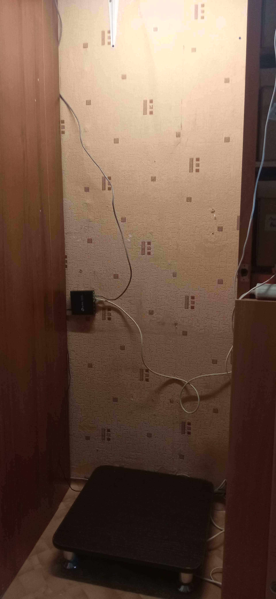

# Физическое устройство инфраструктуры

В начале работы я выделил уголок для будущей стойки.

В дальнейшем я сделаю сюда сварную стойку с выдвижными полками. Я не буду закупать какое-то дорогое серверное оборудование. Первое время обойдусь обычными старенькими компьютерами и рабочей станцией. И дальше базироваться буду на простых ПК, так как для них намного проще найти более дешёвые комплектующие. На данный момент мой парк из ПК-шечек выглядит так:

